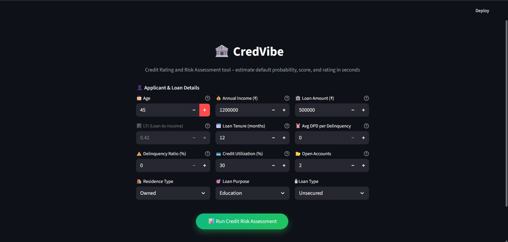
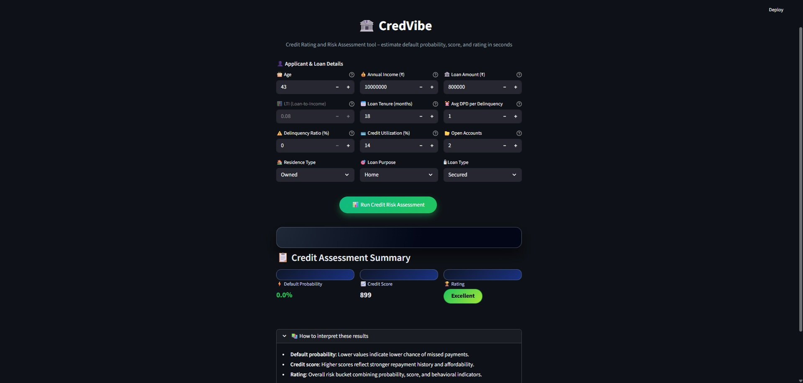
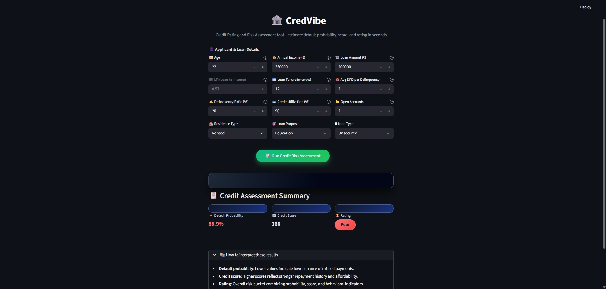
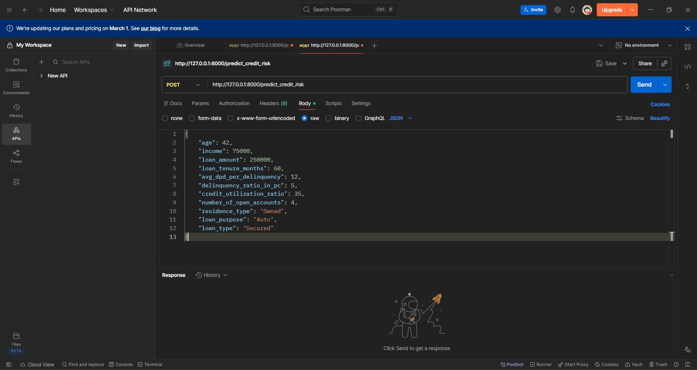
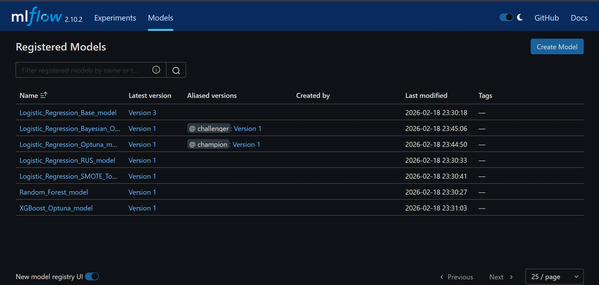
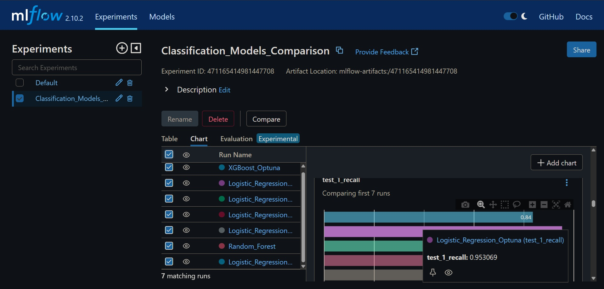
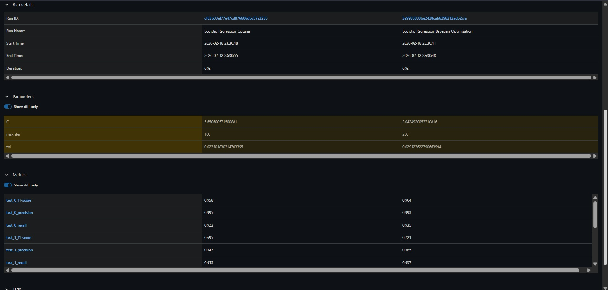
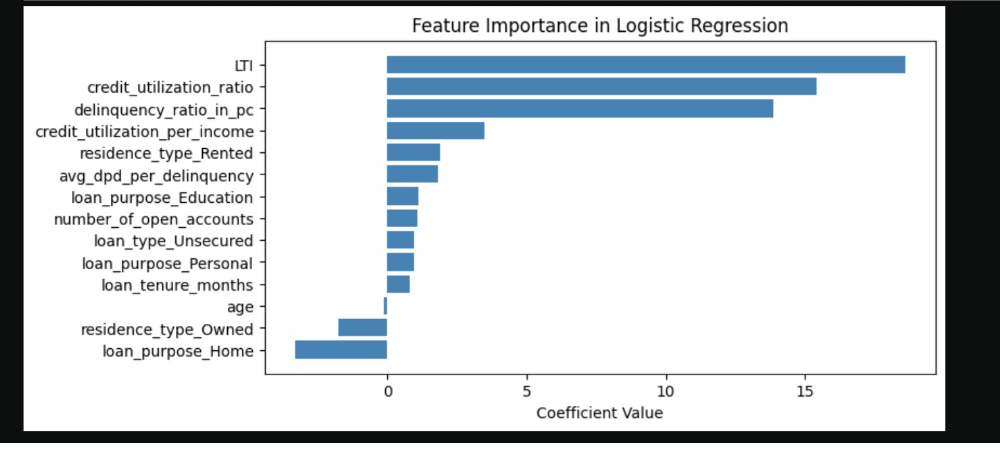
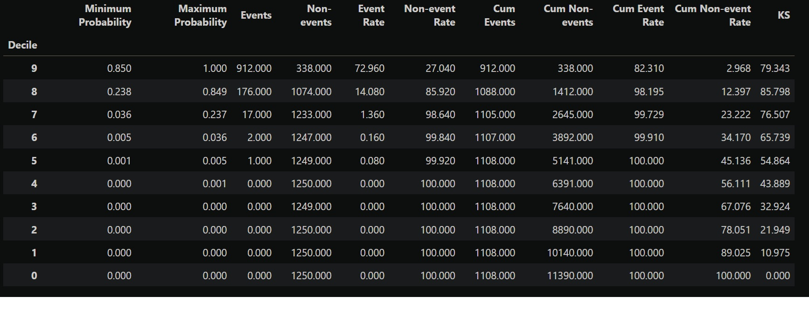

<p align="center">
  
</p>

<h2 align="center">🏦 CredVibe | Credit Rating and Risk Assessment</h2>
<p align="center"><b>AI-powered credit risk evaluation that classifies loan applications into four risk tiers with 95%+ recall.</b></p>

<p align="center">
  <a href="https://streamlit.io/"></a>
  <a href="https://fastapi.tiangolo.com/"></a>
  <a href="https://scikit-learn.org/"></a>
  <a href="https://pandas.pydata.org/"></a>
  <a href="https://optuna.org/"></a>
  <a href="https://mlflow.org/"></a>
</p>

<p align="center">
  <b>Model:</b> Logistic Regression + Optuna &nbsp; | &nbsp; <b>Metrics:</b> Recall 95.31%, Precision 58.55% &nbsp; | &nbsp; <b>Deployment:</b> FastAPI + Streamlit + MLflow
</p>

<p align="center">
  This project uses explainable machine learning to predict default probability and assign CIBIL-like credit scores (300-900) for loan risk assessment, achieving financial industry benchmarks for recall and Gini coefficient.
</p>

---

CredVibe is a production-ready credit risk assessment system developed for an Indian NBFC. It evaluates loan applications using 14 key features across personal, bureau, and loan data sources, delivering instant credit scores and risk ratings (Poor/Average/Good/Excellent) with full explainability for business rule integration.

---

## Features

- **4-Tier Risk Classification**: Categorizes applicants into Poor, Average, Good, and Excellent ratings based on CIBIL-like scoring (300-900).
- **High Recall Optimization**: Achieves 95.31% recall on default class, ensuring 19 out of 20 high-risk defaulters are flagged for review.
- **Explainable AI**: Logistic regression coefficients convertible to business rules for integration with Business Rule Engine (BRE).
- **Dual Interface**: Access via modern Streamlit UI or REST API through FastAPI backend.
- **Real-time Scoring**: Instant credit score calculation with default probability and LTI (Loan-to-Income) derivation.
- **Advanced Feature Engineering**: IV-based selection (IV > 0.02), VIF filtering (VIF < 5), and derived features (Delinquency Ratio, Avg DPD).
- **Class Imbalance Handling**: SMOTE and SMOTE + Tomek Links for balanced training.
- **Hyperparameter Optimization**: Optuna and Bayesian Optimization for model tuning.
- **Financial Validation**: Rank ordering, KS Statistics (>40), Gini (>85), and Decile Analysis for model robustness.
- **Experiment Tracking**: MLflow integration for model versioning and experiment management.

---

## Model Performance

### Champion vs Challenger Comparison

| Metric | Champion (Optuna) | Challenger (Bayesian) | Target | Status |
|---|---|---|---|---|
| **Recall** | **95.31%** | 93.68% | > 90% | ✅ Met |
| **Precision** | **58.55%** | 54.74% | > 50% | ✅ Met |
| **Weighted F1** | **94.21%** | 93.46% | - | - |
| **Macro F1** | **84.21%** | 82.67% | - | - |

### Why Logistic Regression?

While ensemble methods (Random Forest, XGBoost) were evaluated, **Logistic Regression** was selected as the champion model due to:

- **Explainability**: Coefficients directly interpretable as log-odds, easily convertible to business rules for the NBFC's Business Rule Engine
- **Regulatory Compliance**: Transparent decision-making suitable for financial audit and regulatory requirements
- **Production Stability**: Consistent predictions across out-of-time validation (Mar-May 2025)
- **Speed**: Sub-millisecond inference time for real-time scoring

---

## Screenshots

### 1. Streamlit Frontend Interface


### 2. Credit Risk Assessment Results




### 3. FastAPI Backend with Postman



### 4. MLflow Experiment Tracking




### 5. Feature Importance Analysis


### 6. Decile Analysis & KS Statistics


---

## Folder Structure

```bash
credit_risk_evaluation/
│
├── .gitignore                  # Git ignore file
├── LICENSE.md                  # License file
├── README.md                   # Project documentation
├── requirements.txt            # Python dependencies
│
├── Artifacts/                  # Screenshots and visualizations
│
├── Backend/                    # FastAPI backend server
│   └── server.py               # FastAPI entry point with endpoints
│
├── Core/                       # Shared prediction logic
│   ├── __init__.py
│   └── prediction_helper.py    # Model loading, preprocessing, scoring
│
└── Frontend/                   # Streamlit frontend application
    └── app.py                  # Interactive UI with custom CSS
```

---

## Setup Instructions

### Prerequisites

- Python 3.10 or higher
- Git

### 1. Clone the Repository

```bash
git clone https://github.com/inv-fourier-transform/credit_risk_evaluation.git
cd credit_risk_evaluation
```

### 2. Create and Activate a Virtual Environment

```bash
python -m venv venv
# On Windows:
venv\Scripts\activate
# On macOS/Linux:
source venv/bin/activate
```

### 3. Install Dependencies

```bash
pip install -r requirements.txt
```

## 4. Download Model Artifact

Place the trained model file `model_data2.joblib` inside:

```
Artifacts/
```

---

# Running the Application

## Method 1: FastAPI Backend (for API access)

Navigate to the project root and start the server:

```bash
uvicorn Backend.server:app --reload --host 0.0.0.0 --port 8000
```

The API will be available at:

```
http://localhost:8000
```

### Testing with Postman

1. Open Postman and create a new request  
2. Set request type to **POST** and enter URL:  
   ```
   http://localhost:8000/predict_credit_risk
   ```
3. Go to **Body** tab → Select **raw** → Set type to **JSON**
4. Enter JSON payload:

```json
{
  "age": 35,
  "income": 1200000,
  "loan_amount": 500000,
  "loan_tenure_months": 12,
  "avg_dpd_per_delinquency": 2,
  "delinquency_ratio_in_pc": 10,
  "credit_utilization_ratio": 30,
  "number_of_open_accounts": 2,
  "residence_type": "Owned",
  "loan_purpose": "Home",
  "loan_type": "Unsecured"
}
```

5. Click **Send** and receive JSON response:

```json
{
  "probability": "0.152340",
  "credit_score": 763,
  "rating": "Good"
}
```

**Alternative test endpoint:**  
Send a **GET** request to:

```
http://localhost:8000/test
```

---

## Method 2: Streamlit Frontend (for Web UI)

Open a new terminal, navigate to the project directory, and run:

```bash
streamlit run Frontend/app.py
```

### Access the Application

Open your browser and go to:

```
http://localhost:8501
```

---

## Using the Streamlit Interface

### Enter Applicant Details
Fill in 11 input fields across 4 rows:

- Age  
- Income  
- Loan Amount  
- LTI (auto-calculated)  
- Loan Tenure  
- DPD  
- Delinquency Ratio  
- Credit Utilization  
- Open Accounts  
- Residence Type  
- Loan Purpose  
- Loan Type  

### Click Run Assessment

The system processes inputs and displays:

- **Default Probability**  
  - Green: < 25%  
  - Yellow: 25–50%  
  - Red: > 50%  

- **Credit Score**  
  - 300–900 scale with position indicator  

- **Rating Badge**
  - Poor / Average / Good / Excellent  
  - Gradient styling  

### Interpret Results
Expand **"How to interpret these results"** section for guidance.

### New Assessment
Modify inputs and rerun for scenario analysis.

---

# API Endpoints

| Endpoint                | Method | Description                                      |
|-------------------------|--------|--------------------------------------------------|
| /test                   | GET    | Health check endpoint                            |
| /predict_credit_risk    | POST   | Submit applicant data and receive credit assessment |

---

## Request Format (POST /predict_credit_risk)

**Content-Type:** `application/json`  

**Body:** JSON object with applicant features  

---

## Response Format

```json
{
  "probability": "0.152340",
  "credit_score": 763,
  "rating": "Good"
}
```

---

# Technical Architecture

## Feature Engineering

- **IV (Information Value) Screening**  
  Retained variables with IV > 0.02 (Weak to Very Strong predictive power)

- **VIF Analysis**  
  Removed multicollinear features (VIF < 5 threshold)

### Derived Features

- LTI = Loan Amount / Income  
- Delinquency Ratio = Delinquent Months / Total Loans  
- Avg DPD per Delinquency  

---

## Model Training

- **Algorithm:** Logistic Regression with L2 regularization  
- **Optimization:** Optuna (Champion) vs Bayesian Optimization (Challenger)  
- **Resampling:** SMOTE and SMOTE + Tomek Links for class imbalance  
- **Validation:** Out-of-time validation (Mar–May 2025) to ensure temporal stability  

---

## Evaluation Framework

- **Rank Ordering:** Borrowers sorted by predicted probability and grouped into deciles  
- **KS Statistic:** Maximum separation between cumulative distributions of defaulters vs non-defaulters (>40 in top 3 deciles)  
- **Gini Coefficient:** Model discrimination power (>85 considered excellent)  

---

## Scoring Methodology

- **Base Score:** 300  
- **Scale:** 600 points (range: 300–900)  
- **Formula:**  
  ```
  Credit Score = 300 + (1 - Default Probability) × 600
  ```

### Rating Buckets

- Poor: 300–499  
- Average: 500–649  
- Good: 650–749  
- Excellent: 750–900  

---

# Dataset

- **Source:** 2 years of loan data from Indian NBFC (Feb 2023 – Feb 2025)  
- **Train/Validation:** Feb 2023 – Feb 2025  
- **Out-of-Time Test:** Mar 2025 – May 2025 (temporal holdout)  
- **Features:** 14 (11 numeric + 3 categorical)  
- **Data Sources:** Personal data, Bureau data, Loan data  

**Note:** Dataset not included in repository due to client confidentiality.

---

# MLflow Integration

The project uses MLflow for experiment tracking and model management:

- **Experiment Logging:** Tracks hyperparameters, metrics (Recall, Precision, F1, KS, Gini), and artifacts  
- **Model Registry:** Versions champion and challenger models with stage transitions  
- **Comparison:** Side-by-side metric comparison across Optuna, Bayesian, RF, and XGBoost experiments  

---

# Model Training (Optional)

To retrain the model with your own data:

1. Prepare dataset with the 14 features listed above and target variable `default_flag`  
2. Apply IV screening (IV > 0.02) and VIF filtering (VIF < 5)  
3. Handle class imbalance with SMOTE  
4. Run Optuna hyperparameter search on Logistic Regression  
5. Validate on out-of-time data and check KS/Gini benchmarks  
6. Export model to `model_data2.joblib` with scaler and feature metadata  
7. Copy model to `Artifacts/` directory  

---

# Contributing

Contributions are welcome! Please open an issue or submit a pull request for improvements, bug fixes, or feature enhancements.

---

# License

This project is licensed under the MIT License.

---

*Because trusting your gut with someone else's money is how banks become cautionary tales.*